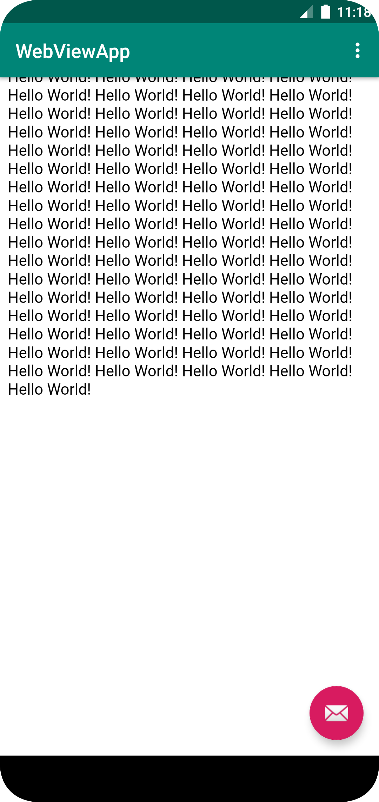

# Rapport

**Skriv din rapport här!**

Skapade en web app med en extern och en intern webview.
Började med att lägga till webview element i content_main. sen ändrades webviews id till my_webview
La till denna koden till oncreate:
AdamsWebView = findViewById(R.id.my_webview);
        AdamsWebView.setWebViewClient(new WebViewClient());
        WebSettings webSettings = AdamsWebView.getSettings();
        webSettings.setJavaScriptEnabled(true);

Skapade en local html file som används för internal webview
Länkar den locala html filen till när internal web knappen blir tryckt
länkar his.se när external web lnappen blir tryckt.

hur appen ser ut när den startar.

den external webviewen

den internal webviewen

